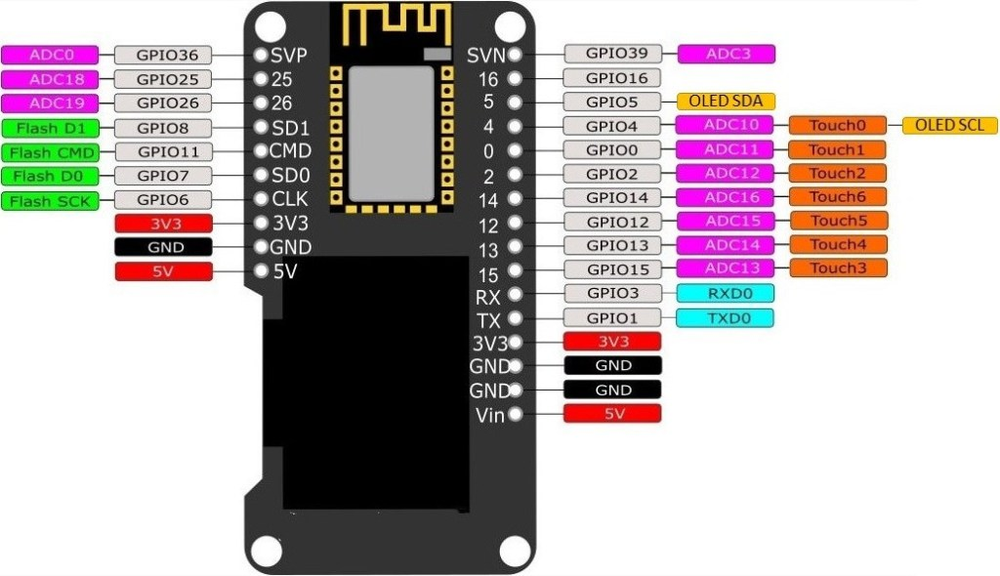

# Arduino core for ESP32 WiFi chip OLED testing

### Need help or have a question? Good luck, I am clueless too.

## Contents
- [Development Status](#development-status)
- [Installation Instructions](#installation-instructions)
- [Decoding Exceptions](#decoding-exceptions)
- [Issue/Bug report template](#issuebug-report-template)
- [ESP32Dev Board PINMAP](#esp32dev-board-pinmap)

## Development Status

Working at this whole thing.

## Installation Instructions
- Use VSCode with PlatformIO

#### Decoding exceptions

I have no idea how to do this or what they are talking about.

#### Issue/Bug report template
Before reporting an issue, make sure you've searched for similar one that was already created. Also make sure to go through all the issues labelled as look here.

Finally, if you're sure no one else had the issue, it's probably you.

## ESP32Dev Board PINMAP

## Hint

To program ESP32 via serial you must press the program button on the board when the editor shows it is trying to connect to the board.